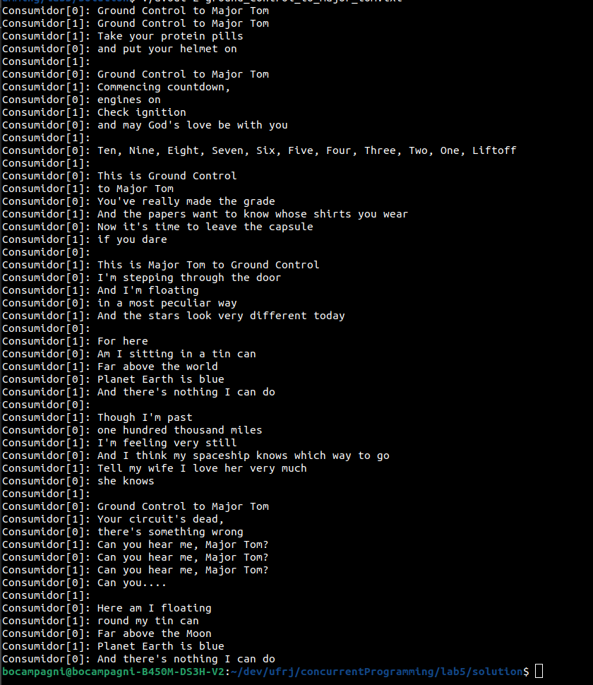

## Atividade 01

### Os valores impressos foram sempre o valor esperado ? Por que ?

Foram sempre o esperado porque implementamos uma sessão crítica usando semáforos. E como inicializamos da forma correta, apenas uma thread consegue, por vez, incrementar o valor da variável global.

## Atividade 02

### Quais são os possíveis valores finais da variável X ?

O valor sempre será 2. Em qualquer possibilidade de combinação de ordem de execução das threads sempre existirá um bloqueio para garantir a ordem de execução correta. Se, na pior das hipóteses, 3 executar primeiro que 2, que executa primeiro que 1. 3 irá bloquear-se até a condição emitida por 2, que se bloqueia até a condição emitida por 1. 

Em 1, incrementa-se de 0 a 1. Da-se o sinal para a thread 2.
Em 2, incrementa-se de 1 para 2. Da-se o sinal para a thread 3.
Em 3, printamos a variável e finalizamos o fluxo de execução dessas tarefas.

### O valor final da variável X variou ? Por que ?

Sim, o valor irá variar porque agora a condição de passagem de 2 já está preenchida a nível de inicialização. Não é mais necessário que 1 garanta essa mensagem para a segunda thread. Assim, é possível ocorrer condição de corrida entre a primeira e segunda thread.

A mesma situação ocorre para a terceira thread, que não necessita mais que a segunda thread emita um sinal para sua passagem.

Os valores possíveis são os valores do conjunto **S** tal que **S = {0,1,2}**.

## Atividade 03

### Qual é a finalidade das variáveis in e out e por que foram definidas como variáveis static.

O static é usado para declarar uma variável que apesar de ter escopo local, salva seus valores globalmente e não é inicializada toda vez que um fluxo de execução a encontra. Inicialia-se apenas uma vez e os valores são recordados toda vez que um fluxo de execução encontra essa variável.

Ou seja, se definirmos uma variável static dentro de uma função X, seu armazenamento continua o mesmo apesar da função ter chegado ao fim de sua execução. É um meio termo entre a variável local e a variável global.

A variável in e out controla o fluxo de escrita e controle de consumo por meio de indexação, 
lembrando que devido a elas serem `static` ela só é instanciada uma vez, tendo seu valor não alterado caso outro fluxo de execução encontre a linha de atribuição de valor inicial.

### O programa executa corretamente ? Como isso foi demonstrado ?

Sim, foi executado corretamente. O fluxo de controle com incremento modular foi suficiente para as operações de produção e consumo. A demonstração se mostrou via aproximação empírica. 

### Execução da solução com o arquivo especificado dentro da pasta solution

